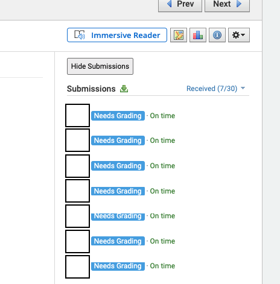
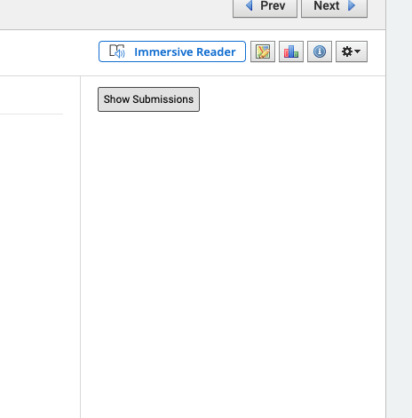
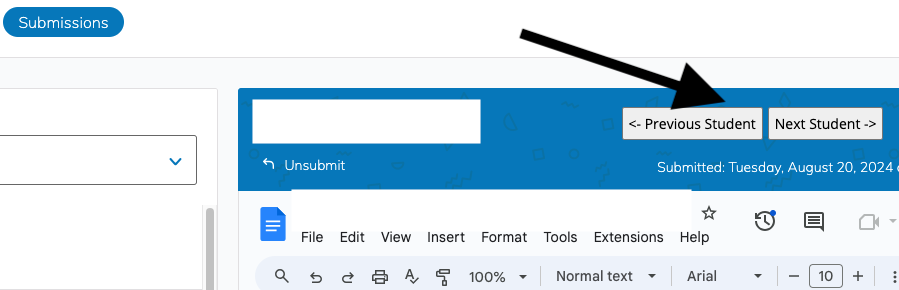

# Schoology Teacher Fixes

This is an unpacked Chrome extension. For details on how to load an unpacked extension see [Google&#39;s Loading an unpacked extension instructions](https://developer.chrome.com/docs/extensions/mv3/getstarted/development-basics/#load-unpacked).

This extension fixes two issues for teachers.

* Google Doc Assignment Scrolling Fix
* Hide/Show student submissions
* Previous and Next Student buttons added to Google Docs assignment grading

## Schoology Google Doc Scrolling Fix

This fixes the CSS on the submission page for teachers. Normally the page contains a long list of student submissions that does not scroll independantly. This fixes that so that you can scroll through students without scrolling past the current Google Doc submission.

### Before

### After

## Hide/Show Student Submissions

This adds a hide/show button to student submissions on Schoology assignments. This allows teachers to hide their submissions so that they can present assignment pages without sharing student grading information to the entire class by mistake.

### Example

## Previous and Next Student Buttons for Google Doc Assignments

### Example
