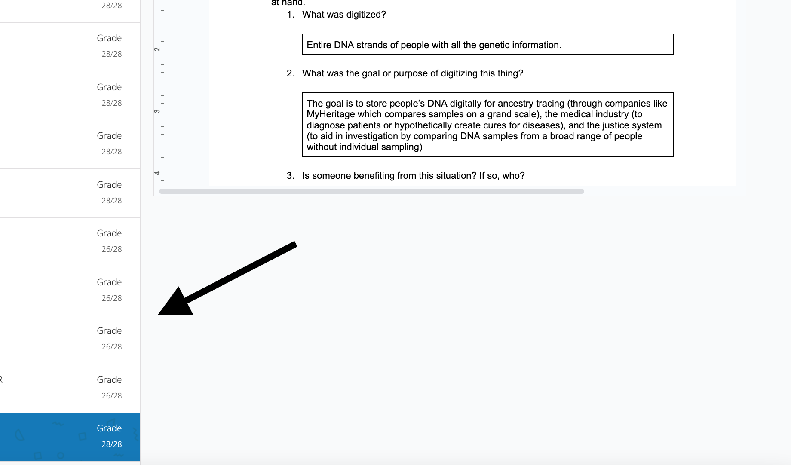
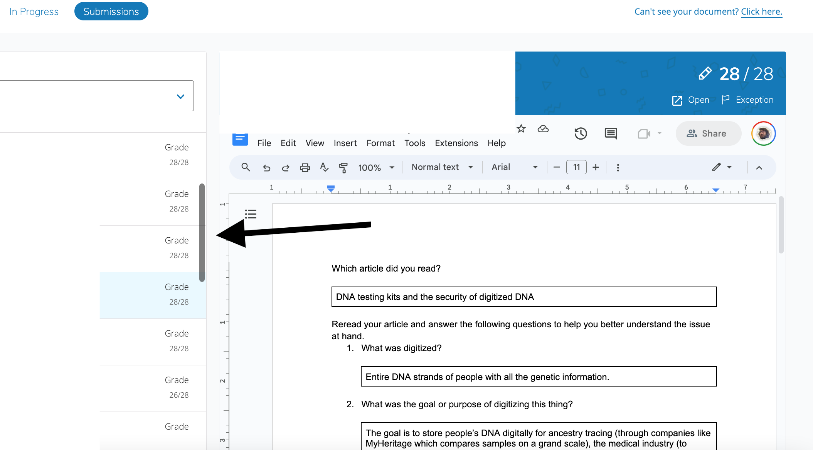

# Schoology Google Doc Scrolling Fix
This is an unpacked Chrome extension. For details on how to load an unpacked extension see [Google's Loading an unpacked extension instructions](https://developer.chrome.com/docs/extensions/mv3/getstarted/development-basics/#load-unpacked).

This fixes the CSS on the submission page for teachers. Normally the page contains a long list of student submissions that does not scroll independantly. This fixes that so that you can scroll through students without scrolling past the current Google Doc submission.

### Before

### After

