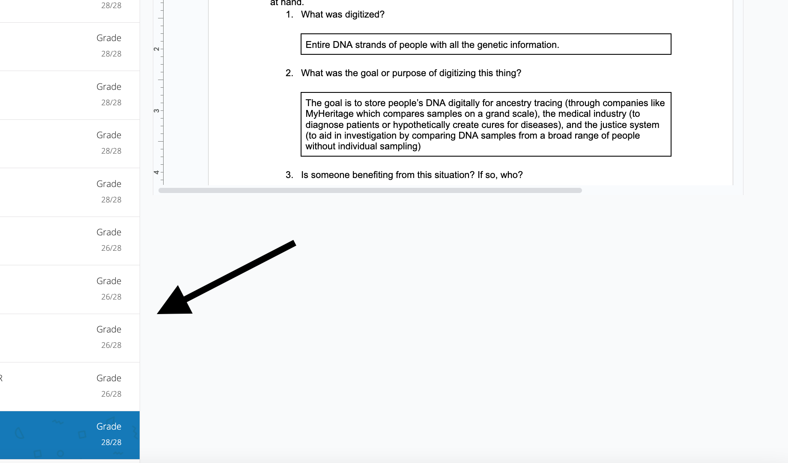
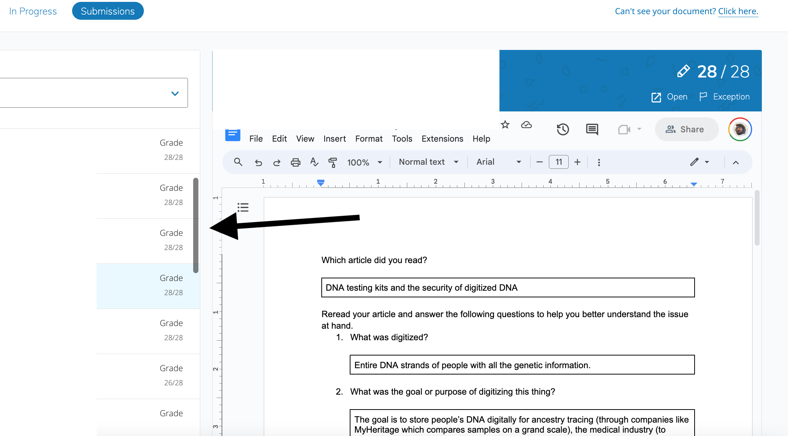
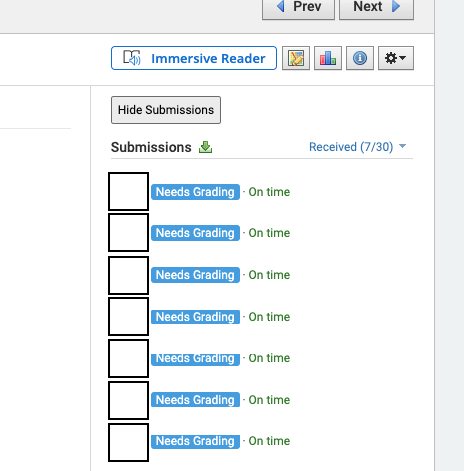
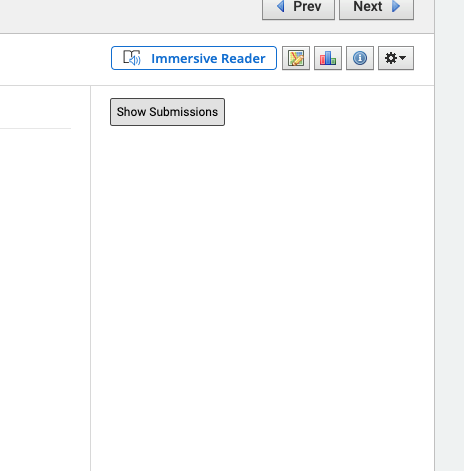
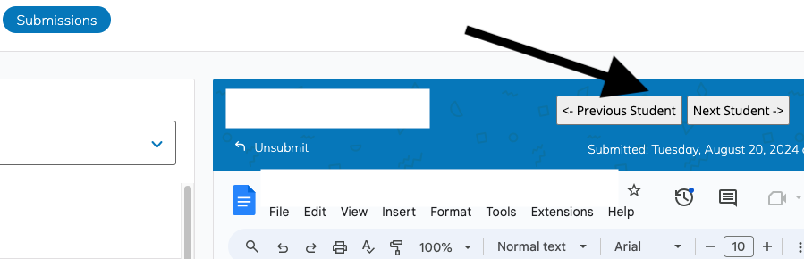

# Schoology Teacher Fixes

This is an unpacked Chrome extension. For details on how to load an unpacked extension see [Google's Loading an unpacked extension instructions](https://developer.chrome.com/docs/extensions/mv3/getstarted/development-basics/#load-unpacked).

This extension fixes several UI issues and improves the grading workflow for teachers using Schoology.

* Google Doc Assignment Scrolling Fix
* Hide/Show student submissions
* Previous and Next Student buttons added to Google Docs assignment grading
* **NEW:** Full-Screen Document Viewing for distraction-free grading

## Schoology Google Doc Scrolling Fix

This fixes the CSS on the submission page for teachers. Normally the page contains a long list of student submissions that does not scroll independently. This fixes that so that you can scroll through students without scrolling past the current Google Doc submission.

### Before

### After

## Hide/Show Student Submissions

This adds a hide/show button to student submissions on Schoology assignments. This allows teachers to hide their submissions so that they can present assignment pages without sharing student grading information to the entire class by mistake.

### Example

## Previous and Next Student Buttons for Google Doc Assignments

Adds navigation buttons directly to the grading header, allowing you to click to the next student's assignment without having to scroll through the right-hand sidebar. 

### Example

## Full-Screen Document Viewing

Adds a "⛶ Full Screen" button next to the student navigation controls. Clicking this expands the Google Document to fill your entire browser tab, hiding the rest of the Schoology interface for a cleaner grading experience. 

* **Smart Navigation:** While in full-screen mode, the "Previous Student" and "Next Student" buttons float in the top right corner. This allows you to grade an entire class's worth of documents without ever leaving full-screen mode.
* **Easy Exit:** You can exit full-screen mode by clicking the "✖ Exit Full Screen" button or simply by pressing the `Esc` key on your keyboard.